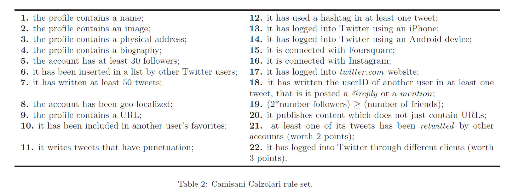
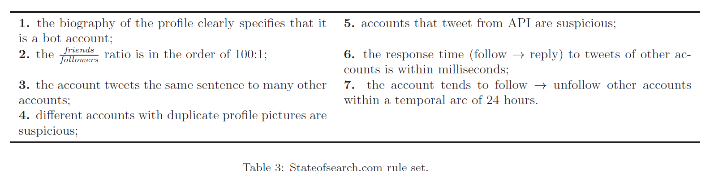
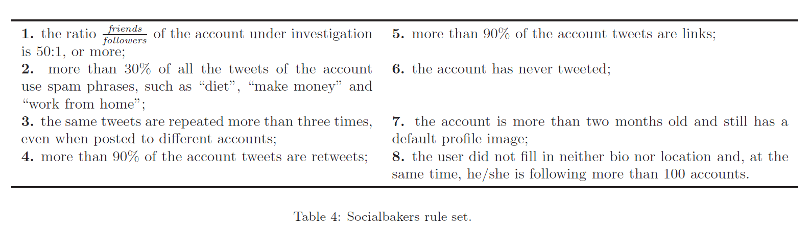
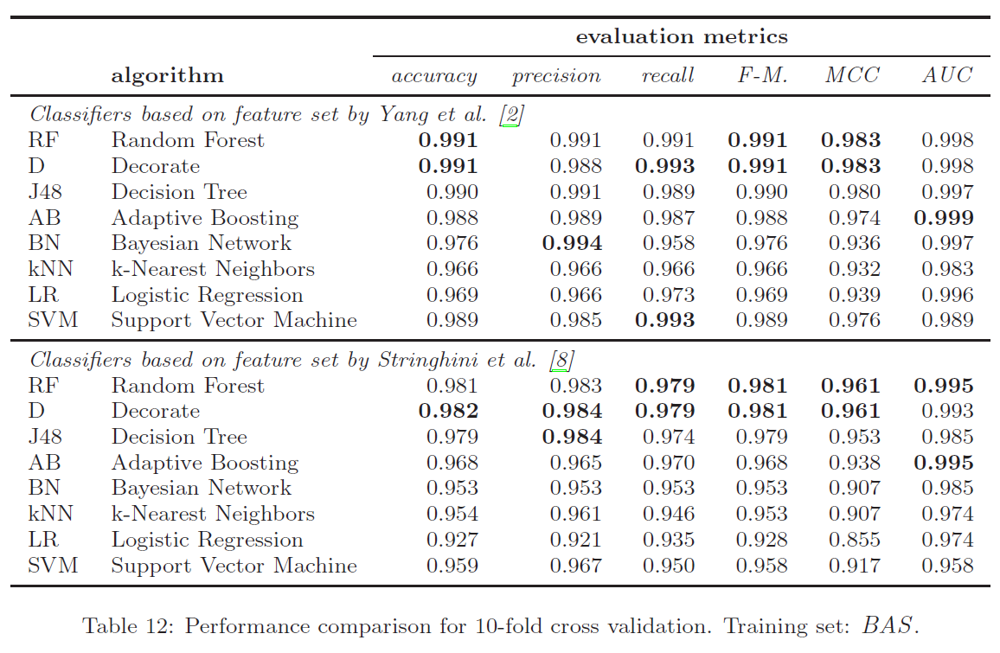
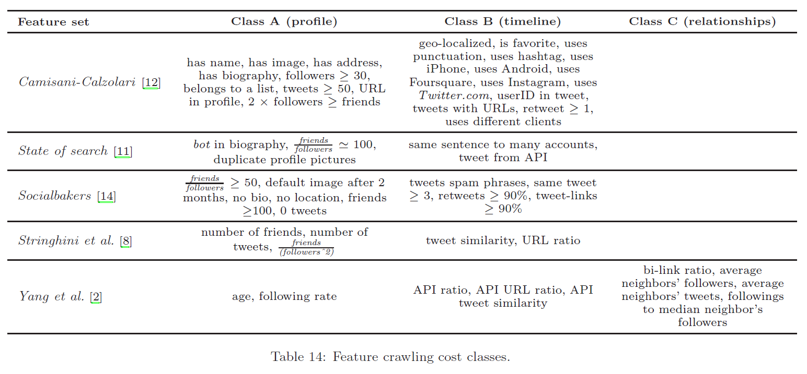

# BigDataProject3
Automatic detection of fake twitter followers

# Research paper summary

## The baseline datasets
- 9M accounts
- 3M tweets
  
### Fake project
Twitter account created to be followed by real accounts to collect data.
Referred as TFP  
  
### #Elezioni2013 dataset
Named E13, data mining of the twitter accounts involved in the #elezioni2013 and after discarding officially involved accounts and sampling the lefts ones, they manually checked the remaining accounts(1488).  
From this work resulted 1481 human accounts labeled.  
  
### Baseline dataset of human accounts
So TFP and E13 are the starting set of human accounts "HUM".  
  
### Baseline dataset of fake followers
3k fake accounts bought:  
    1169 FSF (fast followers)  
    1337 INT (intertwitter)  
    845 TWT (1000 but 155 got insta banned, from twittertechnology)  
  
Dataset is clearly illustrative and not exhaustive of all possible fake accounts.  

### Baseline dataset
Studies have shown that the distributions between classes in classification datasets can affect the classification.  
  
Twitter advanced that the amount of spam/fake accounts should be less then the 5% of MAU (monthly active users), not applicable for our problem because they cant be assimilated to out dataset and an account buying fake accounts, will have a abnormal distribution of fake/real accounts.   
--> <5% can't be transferred to fake followers of an account.  
  
They decided to go for a balanced distribution -> used 5%-95%(100 HUM - 1900 FAK)to 95%-5%(1900 HUM - 100 FAK) proportions to train the classifier, considering their accuracy with cross-validation.      

To obtain a balanced dataset, we randomly undersampled the total set of fake accounts (i.e., 3351) to match the size of the HUM dataset of verified human accounts. Thus, we built a baseline dataset of 1950 fake followers, labeled FAK. The final baseline dataset for this work includes both the HUM dataset and the FAK dataset for a total of 3900 Twitter accounts. This balanced dataset is labeled BAS in the remainder of the paper and has been exploited for all the experiments described in this work (where not otherwise specified). Table 1 shows the number of accounts, tweets and relationships contained in the datasets described in this section.

## Classifiers used for fake detection
From 3 procedures proposed, they assessed their effectiveness by trying them on their dataset. Depending on their efficiency, they will be used later as features to fit the classifiers.

### Followers of political candidates.
Test on Obama, Romney and Italian Politicians followers. Algorithm based on public features from the accounts. The algo assigns human and bot scores and classifies an account considering the gap between the sum of the two scores. The algo assigns a human point for each feature in the "feature table".  

On the other hand it receives a bot point when not meeting one of the features and 2 points for only using API.  
(specificities of each feature can be read in the paper)

### Stateofsearch.com
This website proposed the following rule set:  

This rule set doesn't focuses on the account but on the tweets emitted. The rules looking for similarities are done over the dataset.  
Important: because temporal isn't available and twitter's API limitation rule 6&7 were not applied.

### Socialbakers’ FakeFollowerCheck
Fakeness classification tool based on 8 criteria:  

### Evaluation methodology
The 3 methods were tested on our human dataset and fake followers. We used the confusion matrix as standard indication of accuracy:  
REMINDER:  
- True Positive (TP): the number of those fake followers recognized by the rule as fake followers;
- True Negative (TN): the number of those human followers recognized by the rule as human followers;
- False Positive (FP): the number of those human followers recognized by the rule as fake followers;
- False Negative (FN): the number of those fake followers recognized by the rule as human followers.

Using the folowing metric:  
- Accuracy: the proportion of predicted true results (both true positives and true negatives) in the population, that is   $$\frac{TP+TN}{TP+TN+FP+FN}$$
- Precision: the proportion of predicted positive cases that are indeed real positive, that is   $$\frac{TP}{TP+FP}$$
- Recall (or also Sensitivity): the proportion of real positive cases that are indeed predicted positive, that is   $$\frac{TP}{TP+FN}$$
- F-Measure: the harmonic mean of precision and recall, namely   $$\frac{2·precision·recall}{precision+recall}$$
- Matthew Correlation Coefficient (MCC from now on) [37]: the estimator of the correlation betweenthe predicted class and the real class of the samples, defined as:  
$$\frac{TP·TN-FP·FN}{\sqrt{(TP+FN)(TP+FP)(TN+FP)(TN+FN)}}

In addition to these they also measured two additional metrics:
- Information Gain (Igain): the information gain considers a more general dependence, leveraging probability densities. It is a measure about the in-
formativeness of a feature with respect to the predicting class
- Pearson Correlation Coefficient(PCC): the Pearson correlation coefficient can detect linear dependencies between a feature and the target class. It is a measure of the strength of the linear relationship between two random variables X and Y.

### Evaluation of CC algorithm

Not very good at detecting bots, but decent job with humans.
### Individual rules evaluation
Here they analyzed the effectiveness of each individual rule.

## Fake detection based on feature
Classification using 2 sets of features extracted from spam accounts.
Important: features extracted from spammers but used for fake followers. 
To extract these features, they used classifiers producing glass-box(white-box) and black-box models.
### Spammers detection in social networks.
Use of Random Forest which results in classification but also features:  

### Evolving twitter spammers detection
Since spammers are changing their behavior to avoid detection here are a set of features to still detect them even when using evasion systems:  

### Evaluation of these features
Single features evaluation:   

Features evaluation using them with classifiers:  

The results are very good, the classification accuracy is really high for all the classifiers.  
The features-based classifiers are way more accurate then CC-algorithm to predict and detect fake followers.

### Discussion of the results
By analysing the classifiers we extracted the most effective features:  
- for decision Trees, the features close to the root
- Decorate, AdaBoost, and Random Forest are based on Decision tress but they are a composition of trees and therefore are harder to analyse.

#### Differences between fake followers and spammers
URL ratio is higher for fake followers (72%) and only 14% for humans.  
API ratio is higher for spammers then humans. For fake followers it is lower than 0.0001 for 78%.  
The average neighbor's tweets features is lower for spammers than for fake followers.  
  
Fake followers appear to be more passive compared to spammers and they do not make use of automated mechanisms.

#### overfitting
Usual problem of classification is to be suited too much for the training dataset and not for new data. To avoid overfitting the best idea is to keep a simple classifier.  
For decision tree algorithms reducing the number of nodes and the height of the tree helps.  
For trees, common practice is to adopt an aggressive pruning strategy -> using the reduce-error pruning with small test sets. This results in simpler trees(less features) but maintaining good performances.
  

#### Bidirectional link radio
This is the feature with the most information gain. To test out its importance in detecting the fake from humans, we retry the classifiers excluding this feature and see how they compare with the classifiers trained with the bidirectional link radio feature.

From the previous table we realize that the feature isn't essential but greatly effective.

## An efficient and lightweight classifier

As we notice, classifiers based on features sets perform better than rule sets. To further improve the classifier we analyse their cost.

### Crawling cost
We divide the type of data to crawl into 3 categories:  
- profile (Class A)
- timeline (Class B)
- relationship (Class C)
  
These categories are directly related to the amount of data that needs to be downloaded for a category of feature. To do so we compare the amount of data to be downloaded for each category (best and worst case scenarios -> best is 1 API call and worst is for the biggest account possible)  
We also take into account the maximum amount of calls allowed by the twitter API which defines our max threshold of calls.  
Parameters of the table: 
- $f$ : number of followers of the target account;
- $t_i$ : number of tweets of the i -th follower of the target account;
- $\phi_i$ : number of friends of the i -th follower of the target account;
- $f_i$ : number of followers of the i -th follower of the target account.
  
 
Important: It is important to notice that calls download all the information available for the account, therefore obtaining the data for the different classes concurrently.

### Class A classifier

  

The classifiers belong to the class of the most expensive feature.
Here we experiment the results obtained with the cheapest classifier working with class A features.  
  
The classifiers are tested on 2 features sets: the class features and all the features.
We can see some classifiers improving and others slightly dropping in performance.

### Validation of the Class A classifier
Two experiments:
- Using our baseline dataset as training
- Using Obama's followers as training

For each of these experiments we tested the classifiers with these testing datasets:  
- human accounts 
- 1401 fake followers not included in the BAS dataset

For this validation we can see notable differences between the approaches.
We can also see the the random sample was more correctly labeled then the Obama's sample meaning the Obama's dataset introduces previously unknown features from the training sets.

### Assessing Class A features

To assess the importance of the features used in Class A features we used an information fusion-based sensitivity analysis.   
Information fusion is a technique aimed at leveraging the predictive power of several different models in order to achieve a combined prediction accuracy which is better than the predictions of the single models.  
Sensitivity analysis, instead, aims at assessing the relative importance of the
different features used to build a classification model.  
  
By combining them we can estimate the importance of certain features used in different classifiers with a common classification task.

To do so  we have to retrain the classifiers of the 8 class A classifiers with our baseline dataset and remove one feature at a time.  
Each of the trained classifiers is then tested with our test dataset.
